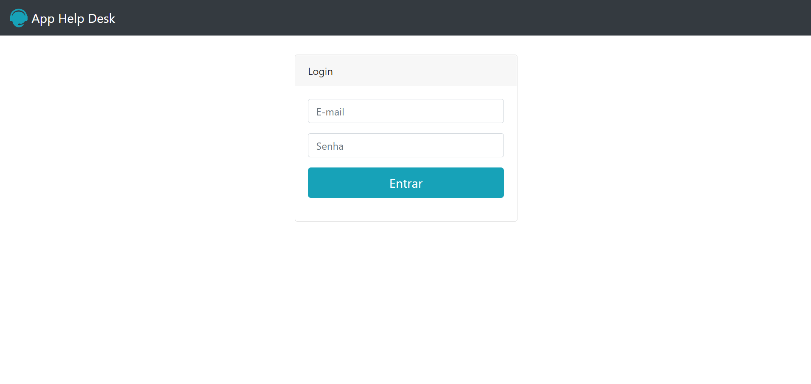
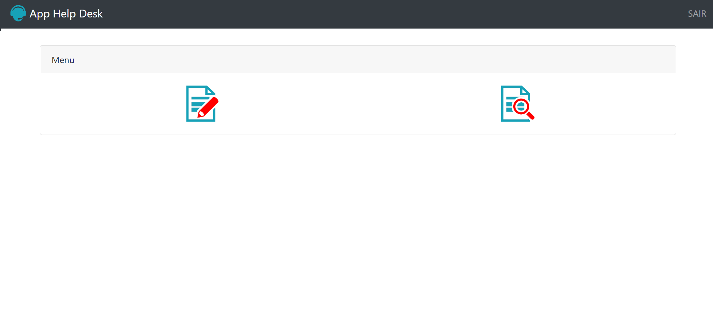
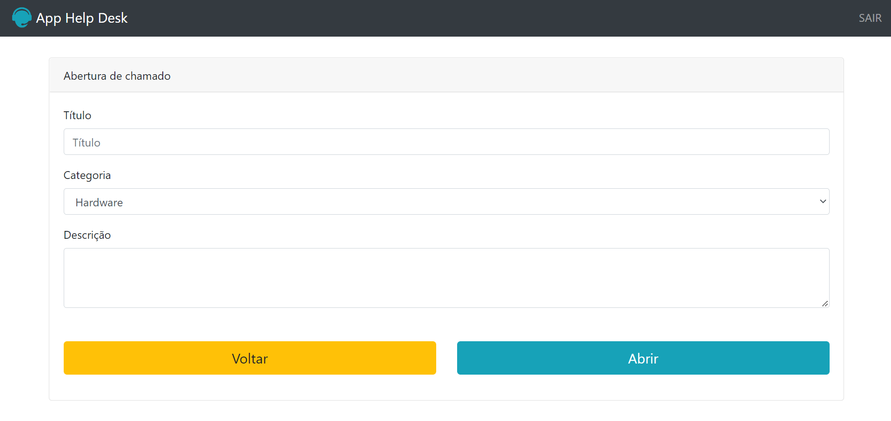
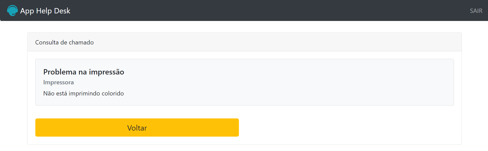

# Help Desk

Projeto do curso de Desenvolvimento Web da Udemy usando HTML, CSS, JavaScript e PHP. O objetivo é ser capaz de fazer login como cliente ou funcionário e poder interagir com os chamados.

